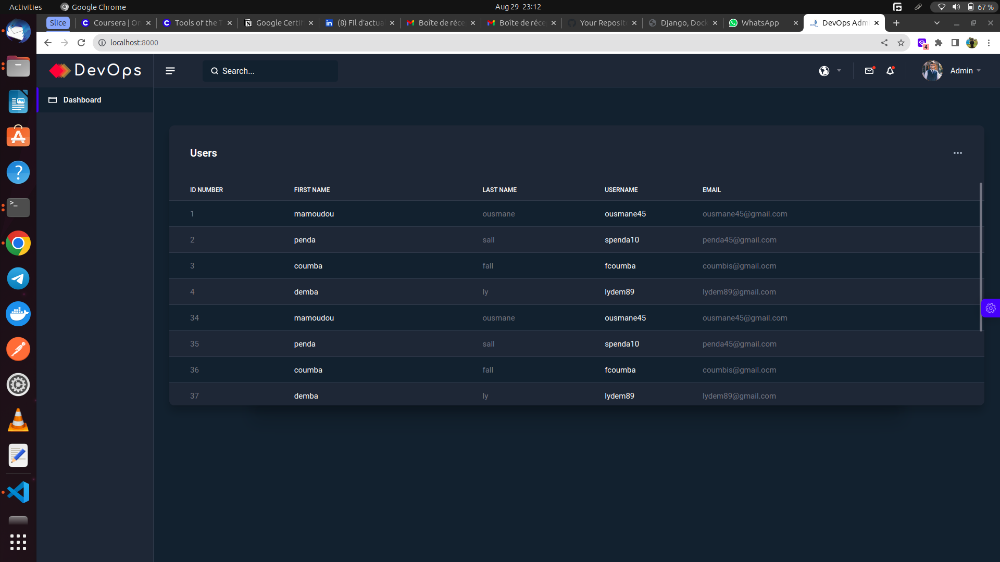
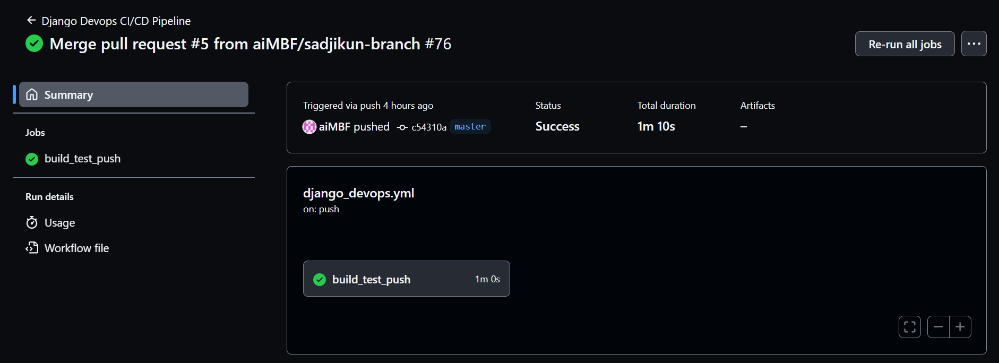

# DevOps Project with Django, Docker, GitHub Actions, and Kubernetes

## Table of Contents
- [Objective](#objective)
- [Development and Deployment Stack](#development-and-deployment-stack)
- [Using Locally](#using-locally)
- [CI/CD with GitHub Actions](#cicd-with-github-actions)
- [Deployment with Kubernetes](#deployment-with-kubernetes)
- [Contributions](#contributions)

## Objective

This project aims to develop a simple Django application and deploy it using a Continuous Integration/Continuous Deployment (CI/CD) pipeline implemented with GitHub Actions, Docker, and Kubernetes.


## Development and Deployment Stack

- Web application: Django and Postgres
- Containerization: Docker and Docker Compose
- Continuous Integration/Continuous Deployment: GitHub Actions
- Container Orchestration: Kubernetes
  
## Using locally

### Preview
* Here is a preview of the web application.



### How to run the project locally
```
$ git clone https://github.com/aiMBF/project-devops.git
$ cd ../path/to/the/project_folder
$ docker-compose up -d --build
After installation, you can access the django web app at http://127.0.0.1:8000/
```

## CI/CD with GitHub Actions

This project implements a GitHub Actions workflow. Whenever changes are pushed to the main branch, the workflow should perform the following actions:
- Build the Docker image for the Django application.
- Run a simple test to ensure the application loads correctly.
- Push the Docker image to a container registry (such as Docker Hub or GitHub's Container Registry, etc.).



## Deployment with Kubernetes

### Setting Up the Development Environment
Ensure you have Minikube installed. [Minikube Installation Guide
](https://minikube.sigs.k8s.io/docs/start/)

Start Minikube:
```
minikube start

```

Deploy the application in Minikube:
```
kubectl apply -f kubernetes/deployment.yaml
kubectl apply -f kubernetes/service.yaml
```
Access the application in your browser:
```
minikube service django-service
```

##  Contributions
For further information you can directly contact the developers of the project
* [Mamoudou Mamadou Sow](<MAILTO:smamadoumamoudou@ept.sn>)
* [Mouhamed Abdoulaye Sadji](<MAILTO:sadjiabdoulaye@ept.sn>)
* [Aissatou Baldé](<MAILTO:baldeaissatou@ept.sn>)
* [Farimata Ngom](<MAILTO:ngfarimata@ept.sn>)

